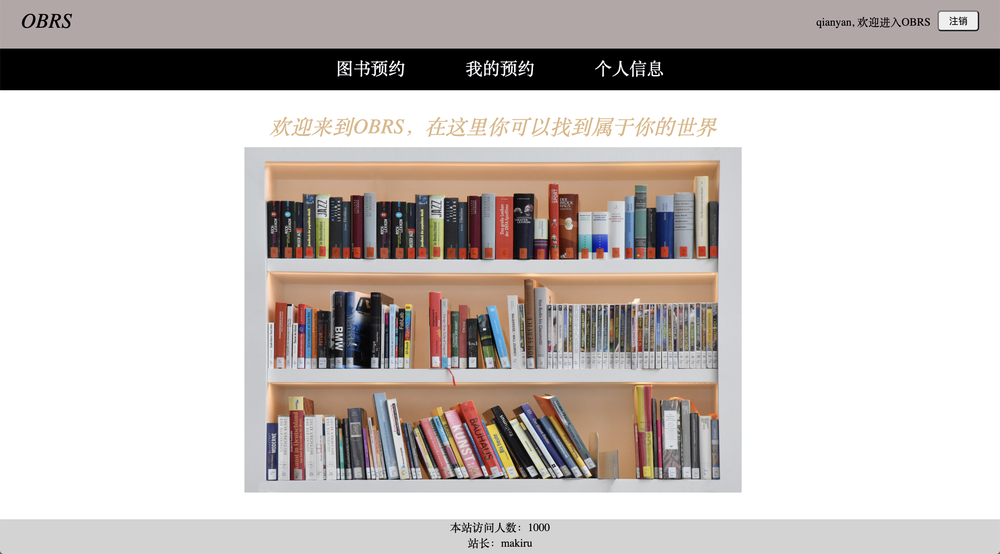
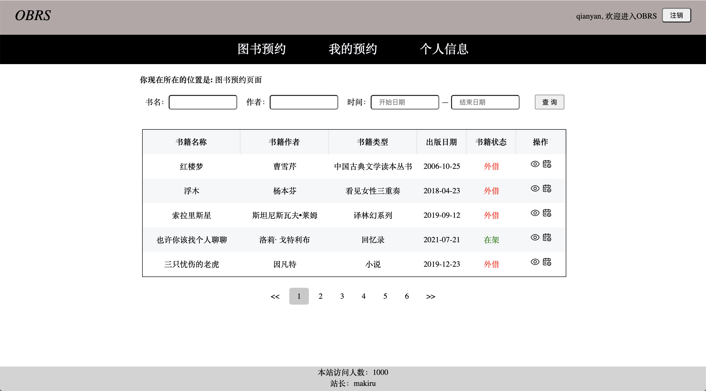
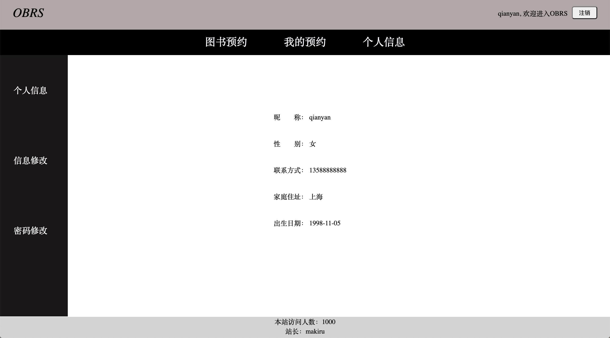
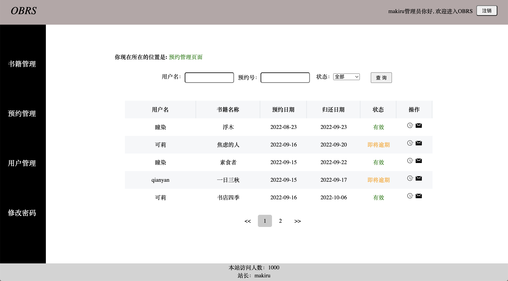
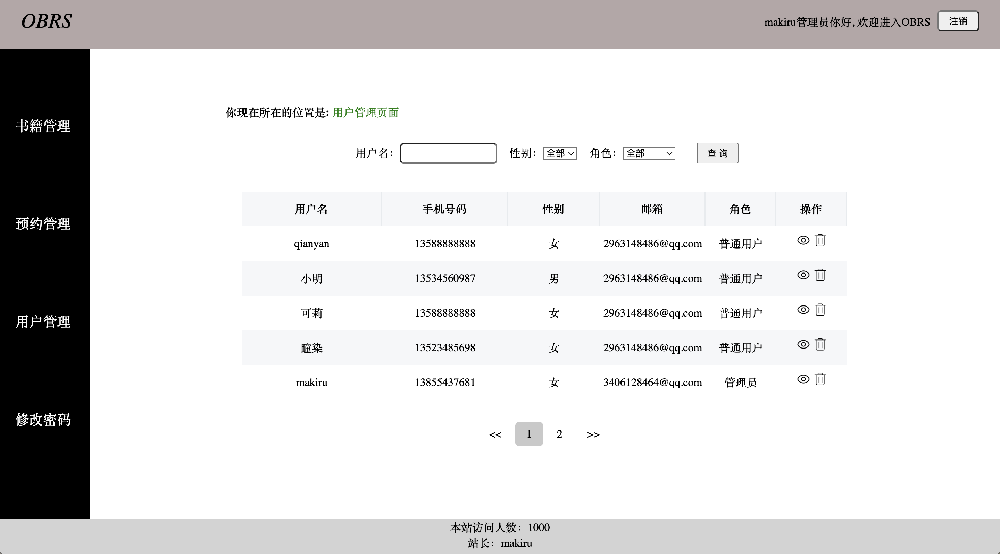

## OBRS(在线图书预约系统)

### 前台页面展示

1、登录页面

2、主页

3、图书列表

4、个人信息

### 后台页面展示

1、主页

2、预约管理

3、用户管理

### 其他

页面过多，不便展示（比如书籍信息，用户邮件通知，续借，预约等页面）

### 技术栈

主要是利用**servlet**+**jsp**+**mysql**实现的

>仅供学习，不做商用（前端代码有点乱，还请谅解(>^ω^<)）